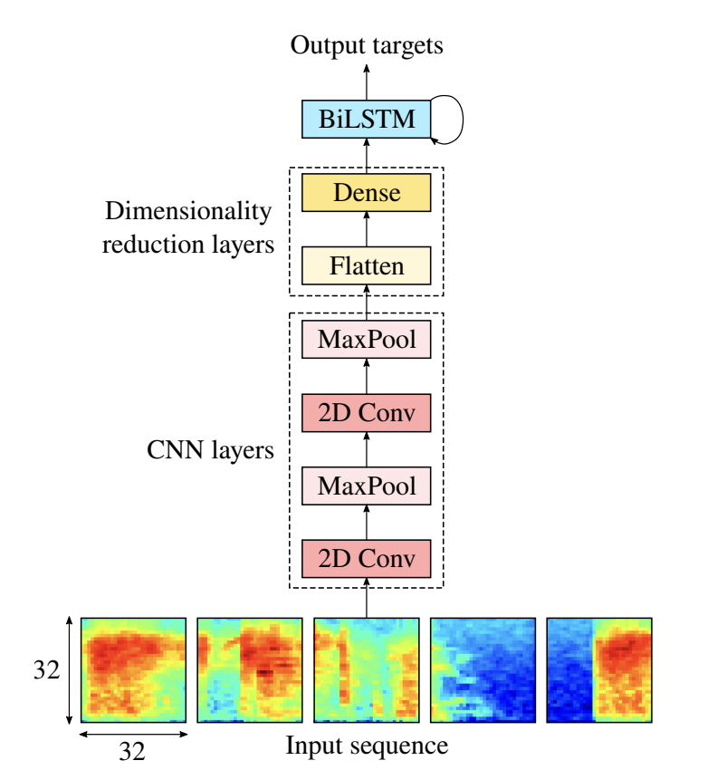
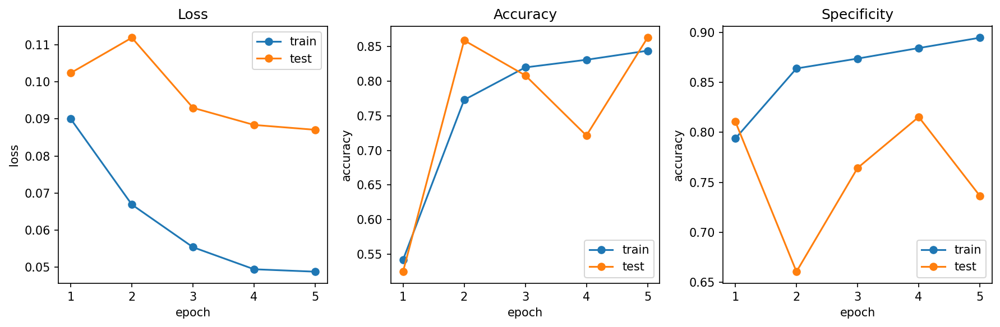
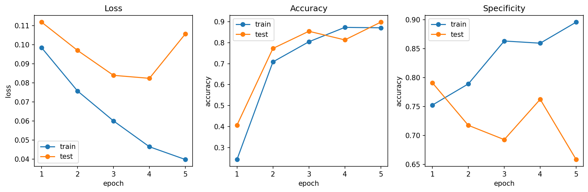
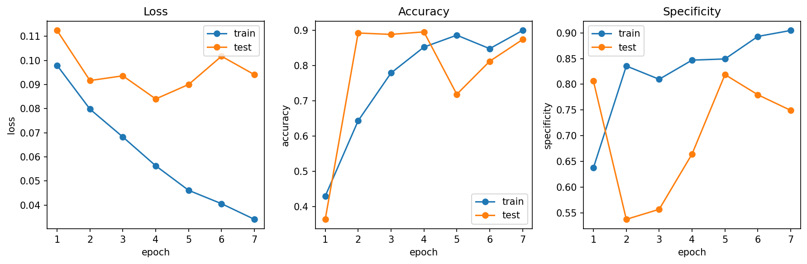

# Option 2. Speaker diarization

HF_TOKE is required for pyannote step and vox_celeb download

## Pyannote-Based

env file - `pyannote-environment.yml`
notebook - `lab2-pyannote.ipynb`

most of the workflow is based on the [tutorial](https://github.com/pyannote/pyannote-audio/blob/develop/tutorials/training_a_model.ipynb)

### Problems
tutorial's DDEG was using float16 data type that caused overflow on the inference stage, custom impl was suggested by claude to tackle this problem

### Results

| Model                 | DER    |
| --------------------- | ------ |
| pretrained            | 11.1%  |
| finetuned (1 epoch)   | 10.8%  |

## Custom

### Voice Audio Detection Model

We chose Wilkinson's hybrid CNN-BiLSTM model [1] for the basis of our voice activity detector (VAD):

We tried different hyperparameters and training time. Also we used the simplified model (without LSTM, the dense layer after flatten is the classifier).

One of the problems that we encountered was that the input data were homogeneous - most of the samples were preprocessed to include little to no silence. This made some versions of the model to degrade quickly to just predicting everything as speech. To mitigate this problem, we used weighted BCE metric. With estimated ratio of speech to silence in the dataset around 0.93, this way we penalized silence miss-identification.

A baseline CNN model metrics:

Untuned CNN+LSTM model performed similarly, and in terms of specificity (ability to identify negatives - in our case, silence) even worse:

The final model was allowed to run for 7 epochs and perfomed better:

We ended up with 2 stacked LSTM layers with dropout 0.5 and internal size 128. The implementation can be found in class [`VoiceActivityDetector`](src/models.py).

During training we formed the batches in a way to minimize paddings. We used voxconverse data and dev-test splits. We did not use data augmentations due to time constraints. Probably, noising images and deleting some speech regions or inserting artificial silence regions would improve specificity even further.

## Segmentation Model

We decided to use the same backbone as for binary VAD with permutation invariant BCE loss calculation as in [2]. We changed the sample windowing/chunking strategy to match the Bredin paper. Instead of doing non-overlapped chunking as in the previous model, we used 5s-windows with step of 500ms.

The main architectural difference was the absence of flatten->dense layers preceeding the head and a bigger size of the LSTM model (internal size 512).

We limited the maximum number of speakers per window at $K_{max}=3$. These speakers were chosen arbitrarily, as the first 3 non-silent speakers. The model then returns for each window a probability that one of the 3 speakers is talking at a given timestamp (samples grouped by 10ms). This probably is a limitation of the model as there are files in the dataset that include over 20 speakers. While not all of them speak simultaneously, there can be situations when the model should be able to ignore one speaker as silence during one window and correctly predict them during the other.

The model did not finish training yet (maybe I'll publish results in another branch) but here are the data from the last 5 batches:

||||||||
|-----------|--------------|----------|-----|----|------|------|
|  batch 119 | loss 0.1838 | acc 0.950 | P 0.562 | R 0.540 | F1 0.550 | spec 0.874 |
  batch 120 | loss 0.2463 | acc 0.911 | P 0.247 | R 0.333 | F1 0.284 | spec 0.678
  batch 121 | loss 0.2890 | acc 0.911 | P 0.573 | R 0.529 | F1 0.549 | spec 0.874
  batch 122 | loss 0.1748 | acc 0.952 | P 0.551 | R 0.594 | F1 0.571 | spec 0.861
  batch 123 | loss 0.2483 | acc 0.930 | P 0.836 | R 0.877 | F1 0.854 | spec 0.930

# References

1. N. Wilkinson and T. Niesler, "A Hybrid CNN-BiLSTM Voice Activity Detector," 2021, doi: https://arxiv.org/abs/2103.03529
2. H. Bredin and A. Laurent, “End-To-End Speaker Segmentation for Overlap-Aware Resegmentation,” HAL (Le Centre pour la Communication Scientifique Directe), Aug. 2021, doi: https://doi.org/10.21437/interspeech.2021-560.

# AI Use Disclosure

Claude Code was used for literature review, explaining concepts, idea validation, debugging, generation of specific functions. Most of the code it generated was tweaked.

Our chats:

1. https://claude.ai/share/a70e0cd6-dc5b-4057-a587-a583ba22c7ff
2. https://claude.ai/share/405cd2b7-a4b5-45a0-a1ad-633d4e8a8f48
3. https://claude.ai/share/b69f6490-7847-4c92-a6b6-bbb483a672e3
